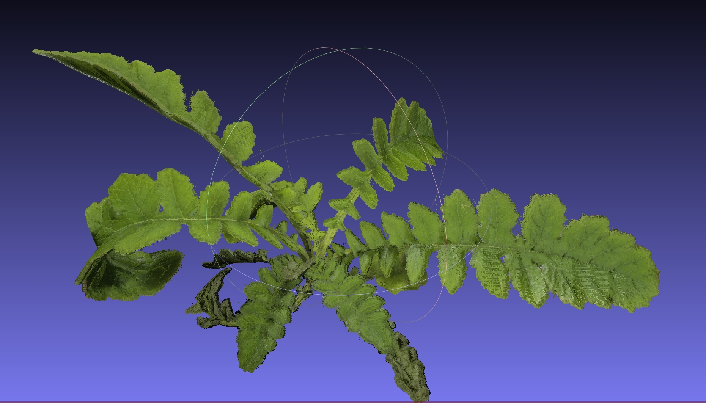

# Unreal Engine 5 Agricultural Robot Simulation

This repo host the Unreal Engine 5 part for the simulation, there is a seperate [ROS2 repo](https://github.com/XingjianL/UE5Sim_colcon_ws) that work along side this simulation. 

`AgriRoboSim2` contains the current project in development using UE5.4.

*Important*: Most assets are not part of this repository per license.

If you want to use the available synthetic images you can download them on [HuggingFace (compressed to 160GB)](https://huggingface.co/datasets/XingjianLi/tomatotest). Or original images on [Globus (750GB)](https://app.globus.org/file-manager?origin_id=2f7f6170-8d5c-11e9-8e6a-029d279f7e24&origin_path=%2Frsstu%2Fusers%2Fl%2Flxiang3%2FTomatoDiseasePhenotyping%2F). The quality difference is not much as detailed on HuggingFace.

If you have particular request on the types of images (for non-commercial and non-generative AI uses) feel free to ask us.

## Usage (.exe), Recommended

The packaged application cannot be uploaded under Github release because it is approximately 4GB.

[The packaged simulation here on Globus (Windows, 4GB)](https://app.globus.org/file-manager?origin_id=2f7f6170-8d5c-11e9-8e6a-029d279f7e24&origin_path=%2Frsstu%2Fusers%2Fl%2Flxiang3%2FTomatoDiseasePhenotyping%2FSimulator%28Windows%29%2F)

To control it using ROS2, I recommend installing Windows Subsystem for Linux (WSL) Ubuntu 22.04. The specific ROS2 package is [here: tomato_xarm6](https://github.com/XingjianL/UE5Sim_colcon_ws). You will need to install further packages for ROS2.

Note: I recommend launch ROS2 first before launching UE5 simulation for successful connection.

## Usage (UE5 editor)
Note: The repository do not contain most plant assets or materials because licenses and storage.

1. Clone repo in file manager and navigate to `Plugin` folder inside `AgriRoboSim2`
2. run `git submodule update --init --recursive` to grab the ROSIntegration plugin
3. Launch UE5.4 in the Launcher
4. `Browse` and select the `AgriRoboSim2.uproject` to open the project
5. Accept the prompt to rebuild now (wait for several minutes)
6. The project should open, the default level is `MainMenu`, it should contain nothing except a line of text.
7. The map `tomato_diseases` will be mostly empty (if it does not crash) as the editor cannot find the assets.
8.  To fill the textures, go to Quixel Megascans to download some materials and plants by `Window -> Quixel Bridge` at the top of the editor. We used a purchased tomato asset [now available on FAB](https://fab.com/s/602393cf0e96). We also used PlantVillage images for tomato disease textures [download](share_link).
9. The simulation can be run alone, but to control the arm and capture images, I recommend using the [ROS2 repository here with the package `tomato_xarm6`](https://github.com/XingjianL/UE5Sim_colcon_ws).

# Images
Point cloud reconstructed from the simulation using RGBD images and segmentation masks using 24 setpoints.

